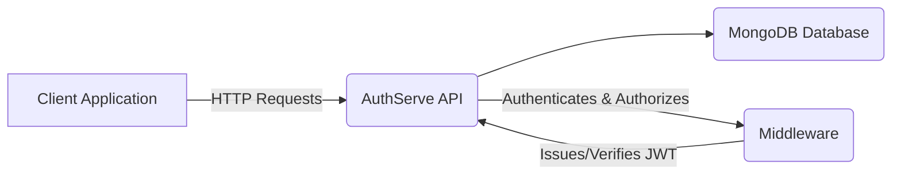
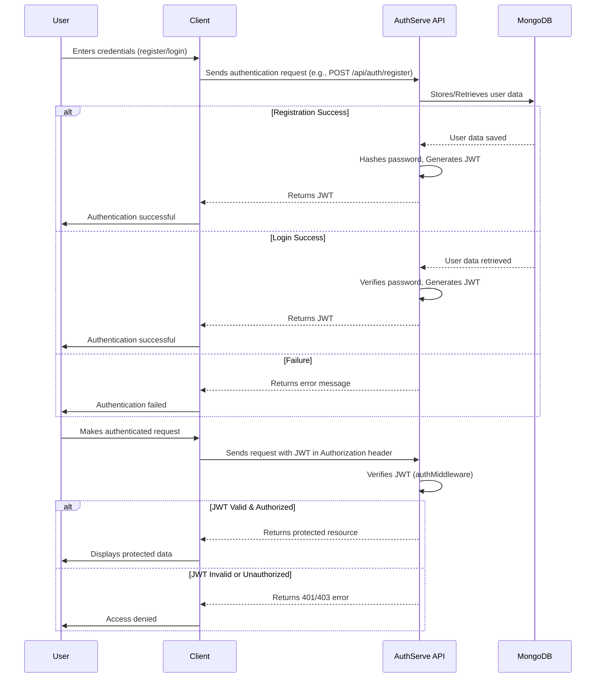

# AuthServe: A Robust Node.js Authentication and Authorization API

AuthServe is a powerful and flexible Node.js API designed to handle user authentication and authorization. It provides a secure and scalable solution for managing user accounts, roles, and access controls in your applications.

## Features

-   **User Registration:** Secure user signup with hashed passwords.
-   **User Login:** Authenticate users and generate JWT (JSON Web Tokens) for secure session management.
-   **Role-Based Access Control (RBAC):** Define and manage user roles (e.g., `user`, `admin`).
-   **Protected Routes:** Middleware to restrict access to certain routes based on authentication status and user roles.
-   **User Management:** Admin functionalities for viewing and managing users.
-   **Password Hashing:** Utilizes `bcrypt` for secure password storage.
-   **JWT Implementation:** Securely issue and verify JSON Web Tokens.

## Technologies Used

-   **Node.js:** JavaScript runtime environment.
-   **Express.js:** Fast, unopinionated, minimalist web framework for Node.js.
-   **MongoDB:** NoSQL database for storing user data.
-   **Mongoose:** MongoDB object data modeling (ODM) for Node.js.
-   **bcrypt.js:** Library for hashing passwords.
-   **jsonwebtoken:** For implementing JSON Web Tokens.
-   **dotenv:** To load environment variables from a `.env` file.

## Setup Instructions

Follow these steps to set up the project locally:

1.  **Clone the repository:**
    ```bash
    git clone https://github.com/aditya6100/AuthServe.git
    cd AuthServe
    ```

2.  **Install dependencies:**
    ```bash
    npm install
    ```

3.  **Create a `.env` file:**
    Create a file named `.env` in the root directory and add the following environment variables:

    ```
    PORT=5000
    MONGO_URI=your_mongodb_connection_string
    JWT_SECRET=your_jwt_secret_key
    JWT_LIFETIME=1h
    ```
    -   `PORT`: The port number the server will listen on.
    -   `MONGO_URI`: Your MongoDB connection string (e.g., `mongodb://localhost:27017/authdb` or a MongoDB Atlas connection string).
    -   `JWT_SECRET`: A strong, secret key for signing JWT tokens.
    -   `JWT_LIFETIME`: The expiration time for JWT tokens (e.g., `1h`, `30d`).

4.  **Seed initial admin user (optional):**
    You can run the `seed.js` script to create an initial admin user.
    ```bash
    node seed.js
    ```
    *Note: Modify `seed.js` to set the desired admin credentials before running.*

## Running the Application

To start the development server:

```bash
npm start
```

The server will run on the port specified in your `.env` file (default: `5000`).

## API Endpoints

### Authentication

-   `POST /api/auth/register`
    -   **Description:** Register a new user.
    -   **Body:** `{ "username": "testuser", "email": "test@example.com", "password": "password123" }`
    -   **Response:** `{ "msg": "User registered successfully", "token": "..." }`

-   `POST /api/auth/login`
    -   **Description:** Log in an existing user.
    -   **Body:** `{ "email": "test@example.com", "password": "password123" }`
    -   **Response:** `{ "msg": "Logged in successfully", "token": "..." }`

### User Management

-   `GET /api/users`
    -   **Description:** Get all users (Admin only).
    -   **Headers:** `Authorization: Bearer <token>` (Admin token)
    -   **Response:** `[ { "_id": "...", "username": "...", "email": "...", "role": "user" }, ... ]`

-   `GET /api/users/:id`
    -   **Description:** Get a single user by ID (Admin only).
    -   **Headers:** `Authorization: Bearer <token>` (Admin token)
    -   **Response:** `{ "_id": "...", "username": "...", "email": "...", "role": "user" }`

-   `PUT /api/users/:id/role`
    -   **Description:** Update a user's role (Admin only).
    -   **Headers:** `Authorization: Bearer <token>` (Admin token)
    -   **Body:** `{ "role": "admin" }`
    -   **Response:** `{ "msg": "User role updated successfully" }`

-   `DELETE /api/users/:id`
    -   **Description:** Delete a user (Admin only).
    -   **Headers:** `Authorization: Bearer <token>` (Admin token)
    -   **Response:** `{ "msg": "User deleted successfully" }`

### Protected Route Example

-   `GET /api/auth/profile`
    -   **Description:** Get the profile of the authenticated user.
    -   **Headers:** `Authorization: Bearer <token>` (Any valid user token)
    -   **Response:** `{ "_id": "...", "username": "...", "email": "...", "role": "user" }`

## Diagrams

### System Architecture



### Authentication Flow



## License

This project is licensed under the MIT License - see the [LICENSE](LICENSE) file for details.