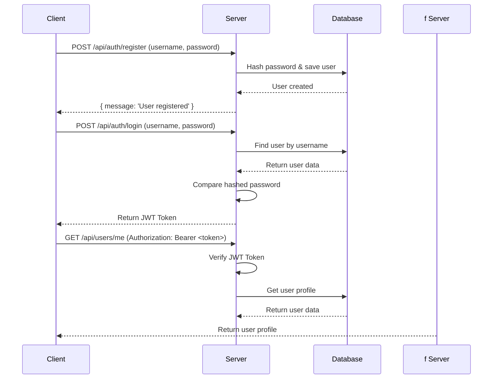

# AuthServe: Role-Based Authentication API

A robust backend server for handling user authentication and management, featuring role-based access control (RBAC). Built with Node.js, Express, and MongoDB, this project provides a secure and scalable foundation for any application requiring user management. This is an intermediate-level project, perfect for portfolio use.

---

### Badges


---

## Features

- **User Authentication**: Secure user registration and login with JWT (JSON Web Tokens).
- **Password Encryption**: Passwords are saved using `bcrypt` hashing.
- **Role-Based Access Control (RBAC)**: Differentiated access levels for `user` and `admin` roles.
- **Protected Routes**: Middleware to protect routes that require authentication.
- **Admin Privileges**: Special routes accessible only by admins (e.g., viewing all users).
- **Scalable Structure**: Organized and modular folder structure for easy maintenance.
- **Environment-Based Configuration**: Uses `.env` for easy configuration of secret keys and database URIs.

---

## Tech Stack

- **Backend**: Node.js, Express.js
- **Database**: MongoDB (with Mongoose)
- **Authentication**: JSON Web Tokens (JWT), bcrypt
- **Validation**: Joi
- **Development**: Nodemon

---

## Folder Structure

```
AuthServe/
├── .env
├── .env.example
├── app.js
├── package.json
├── seed.js
├── config/
├── controllers/
│   ├── authController.js
│   └── userController.js
├── middleware/
│   ├── adminMiddleware.js
│   └── authMiddleware.js
├── models/
│   └── User.js
└── routes/
    ├── authRoutes.js
    └── userRoutes.js
```

---

## Screenshots

*(Add screenshots of your API being tested in Postman or a similar tool.)*

| All Users (Admin) |  Register / Login |
|---|---|
|  |  |

---

## Installation & Setup

Follow these steps to get the project up and running on your local machine.

**1. Clone the repository:**

```bash
git clone https://github.com/aditya6100/AuthServe.git
cd AuthServe
```

**2. Install dependencies:**

```bash
npm install
```

**3. Set up environment variables:**

Create a `.env` file in the root directory and add the following variables. You can use the `.env.example` as a template.

```
MONGO_URI=<YOUR_MONGODB_CONNECTION_STRING>
JWT_SECRET=<YOUR_JWT_SECRET_KEY>
```

**4. Seed the database with an admin user (optional):**

The `seed.js` script will create a default admin user. You can run it with:

```bash
npm run seed
```

---

## How to Run the Project

To run the application in development mode (with auto-reloading):

```bash
npm run dev
```

To run the application in production:

```bash
npm start
```

The server will start on `http://localhost:5000` by default.

---

## API Endpoints

The following table lists the available API endpoints.

| Method | Endpoint              | Description                                   | Access      |
|--------|-----------------------|-----------------------------------------------|-------------|
| `POST` | `/api/auth/register`  | Register a new user.                          | Public      |
| `POST` | `/api/auth/login`     | Log in a user and receive a JWT.              | Public      |
| `GET`  | `/api/users/me`       | Get the profile of the currently logged-in user.| Private     |
| `GET`  | `/api/users/admin/users` | Get a list of all users.                 | Admin-Only  |

---

## Architecture Diagram

This diagram shows the basic authentication flow.



---

## Live Demo / Video

- **Live Link**: [Link to your deployed application]
- **Demo Video**: [Link to a walkthrough video]

---

## Use Cases

- **Foundation for a Web App**: Use this as the authentication backend for a full-stack MERN/MEVN application.
- **Secure a Public API**: Protect your API endpoints by requiring a valid JWT.
- **Learning RBAC**: Understand how to implement role-based access control in a Node.js environment.

---

## Future Enhancements

- [ ] Add password reset functionality (e.g., via email).
- [ ] Implement OAuth 2.0 for social logins (Google, GitHub).
- [ ] Add more robust user profile management (e.g., update profile, change password).
- [ ] Implement refresh tokens for improved security.
- [ ] Containerize the application with Docker.

---

## Contributing

Contributions are welcome! If you have any ideas, suggestions, or bug fixes, please open an issue or submit a pull request.

1.  **Fork the Project**
2.  **Create your Feature Branch** (`git checkout -b feature/AmazingFeature`)
3.  **Commit your Changes** (`git commit -m 'Add some AmazingFeature'`)
4.  **Push to the Branch** (`git push origin feature/AmazingFeature`)
5.  **Open a Pull Request**

---

## License

This project is licensed under the MIT License. See the `LICENSE` file for details.